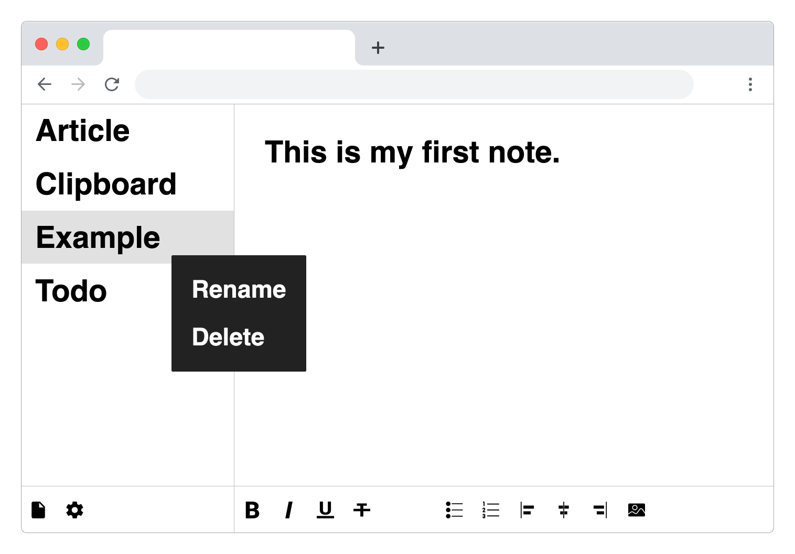

<br>

My Notes — _Chrome extension_ for note-taking in a **New Tab.**

<br>

## Key features

- Notes, Todos, [**Clipboard**](#clipboard), Ideas, any writing — all quickly accessible in a New Tab

- Move the Text between the computers (see [**Context menu**](#context-menu) or [**Google Drive Sync**](#google-drive-sync))

- Autosaved & Autoupdated in every Open window

- [**Google Drive Sync**](#google-drive-sync) – Store the notes to your Google Drive, with an automatic synchronization

- Works offline

<br>

## Installation

https://chrome.google.com/webstore/detail/my-notes/lkeeogfaiembcblonahillacpaabmiop

<br>

## How to open

To open, click the icon (added to the toolbar).
To open automatically in every New Tab, see [**Options**](#options).

<br>

## Options

- Font type (Serif, Sans Serif, Monospace, Google Fonts)
- Font size
- Theme (Light or Dark)
- Keyboard Shortcuts
- Enable Focus mode
- Open My Notes in every New Tab (see [**Permissions**](PERMISSIONS.md))
- Enable Google Drive Sync (see [**Permissions**](PERMISSIONS.md))

<br>

## Clipboard

**Clipboard** — a special note that can receive the text sent by [**Context menu**](#context-menu).
It can also be edited just like any other note, but cannot be renamed or deleted.

<br>

## Context menu

**Context menu** — created to quickly Copy and Paste the selected text to [**Clipboard**](#clipboard).


**Save selection** — Saves the selected text to [**Clipboard**](#clipboard) in your current computer

**Save selection to other devices** —
Saves the selected text to [**Clipboard**](#clipboard) in your other computers (My Notes is needed to be open, same Google Account is needed to be used)

<br>

## Backup

To backup the notes, or to transfer them to a second computer, see [**Google Drive Sync**](#google-drive-sync).

<br>

## Google Drive Sync

**Google Drive Sync** (see [**Options**](#options)) is an automatic two-way synchronization of your notes between My Notes and your Google Drive.

This gives you:

- backup (notes can be restored in future)
- can modify the notes in both sources (Google Drive, My Notes, and vice versa)
- can modify the notes from other computers (by installing My Notes and using the same Google Account)

### Destination

Notes are uploaded to your Google Drive to the folder **My Notes**. This folder is created automatically.
If the folder exists from a previous installation, it is restored, notes are downloaded and uploaded, and the synchronization continues.

### Synchronization

Notes are synchronized immediately after you enable **Google Drive Sync**.
Then on every My Notes **Open/Close/Refresh**, or with the **"Sync Now"** button.
Synchronization works in both ways — to Google Drive, from Google Drive.

### Access

My Notes can only access the files it created.
It cannot see the other files in your Google Drive.

<br>

## Implementation

Implemented in **JavaScript**.
_Lightweight_. Zero external dependencies.
No minification or transpiling in the process — the code you see here, is the same you get; there is no
obfuscation.

Created using modern approach:

- JavaScript Modules (available since Chrome 61)

- ECMAScript Proxy (data to UI updates)

- Event Driven Background Script (run in background, unloaded when not needed)

Data is stored in:

- `chrome.storage`
  - `chrome.storage.local` — Notes and Options (Font type, Font size, etc.), 5MB limit
  - `chrome.storage.sync` — Text sent with [**Context menu**](#context-menu), 100KB limit

- `localStorage` — Collected changes before saving (for optimized saving)

<br>

## Folder structure

```
background/
  google-drive/   # Everything related to Google Drive Sync
                    # - File operations (List, Create, Get, Update, Delete)
                    # - Synchronization (to Google Drive, from Google Drive)
                    # - Queries (find My Notes folder, list files in My Notes folder)
                    # - Multipart bodies (create My Notes folder, create file, update file)
                    # - Tests

  init/           # Run when My Notes is installed/updated
                    # - Sets a Unique ID for My Notes installation (used by Context menu), if not already set
                    # - Migrates notes and options
                    # - Creates Context menu and attaches the events
                    # - Creates a Notification when My Notes is installed/updated
                    # - Registers the ways to open My Notes (icon click, in every New Tab)
                    # - Registers events to trigger Google Drive Sync from My Notes

images/           # Images and icons used in My Notes or README

notes/            # Everything related to Notes
                    # - Create/Rename/Delete notes; Note editing, Note saving
                    # - Toolbar
                    # - Every UI init and update when data changes
                    # - Registers commands (Toggle Focus mode - can be enabled in Options)

options/          # Everything related to Options
                    # - Font type, Font size, Theme, etc.
                    # - Every UI init and update when data changes

shared/           # Everything common (used at more places)
                    # - Date formatting (Last sync)
                    # - Managing the permissions (Requesting, Removing, Checking)
                    # - Helpers for Chrome Storage
                    # - Default values (Notes, Options)

tests/            # Entrypoint for tests
                    # - Runs every __tests__/index.html in the project
                    # - Prints "net::ERR_FILE_NOT_FOUND" if the test file is not found
                    # - Prints "Assertion failed: console.assert" if any assertion failed


.eslintrc         # To enforce code quality and same coding style
.gitignore        # To exclude any generated files (only .DS_Store at this point)

LICENSE           # MIT
manifest.json     # Main extension file


background.html   # Entrypoint for background script
background.js

notes.html        # Entrypoint for notes
notes.css
notes.js

options.html      # Entrypoint for options
options.css
options.js


README.md
SUPPORT.md
CONTRIBUTING.md
PERMISSIONS.md
```

<br><br><br>

[**Support**](SUPPORT.md)&nbsp;&nbsp;&nbsp;[**Contributing**](CONTRIBUTING.md)&nbsp;&nbsp;&nbsp;[**Permissions**](PERMISSIONS.md)
